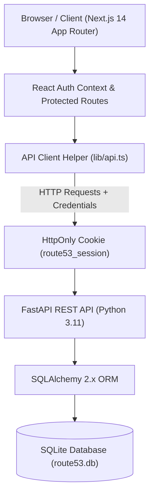
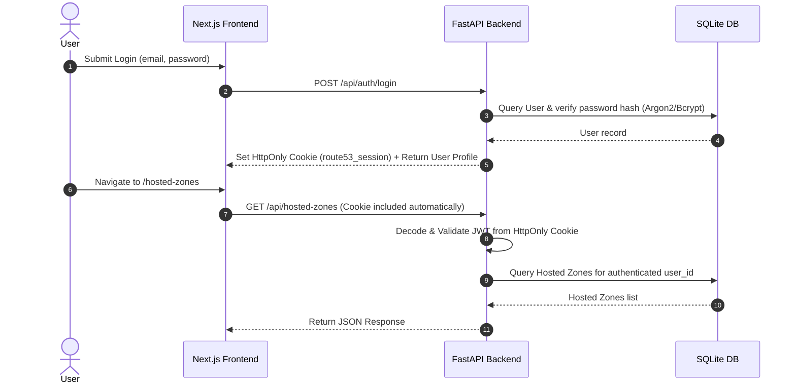
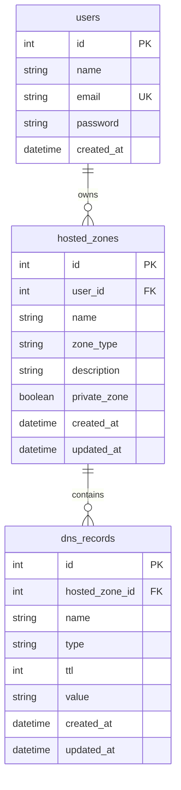

# AWS Route 53 Clone


A full-stack educational clone of the **Amazon Route 53 console**, engineered with **Next.js 14**, **FastAPI**, **SQLAlchemy 2.x**, **SQLite**, and the official **AWS Cloudscape Design System**.

This application reproduces the look, layout, workflow, and user experience of the official AWS Route 53 management console. It provides multi-tenant Hosted Zone management, Resource Record Sets management across 9 supported DNS record types, debounced server-side search, type filtering, server-side pagination, HttpOnly cookie-based session authentication, and automated integration testing.

> [!IMPORTANT]
> **Educational Clone Disclaimer**: This project is built for educational, learning, and portfolio demonstration purposes. It **does not connect to live AWS services**, does not register domain names, and does not alter public internet DNS routing.

---

## 📋 Table of Contents

- [Project Overview](#-project-overview)
- [Feature Matrix](#-feature-matrix)
- [System Architecture](#-system-architecture)
- [Authentication & Security Model](#-authentication--security-model)
- [Database Schema & ERD](#-database-schema--erd)
- [API Specification](#-api-specification)
- [Frontend Architecture & Cloudscape UI](#-frontend-architecture--cloudscape-ui)
- [User-Friendly Error Handling](#-user-friendly-error-handling)
- [Repository Structure](#-repository-structure)
- [Local Setup & Installation](#-local-setup--installation)
- [Database Seeding Instructions](#-database-seeding-instructions)
- [Testing & Automated Verification](#-testing--automated-verification)
- [Project Limitations & Future Roadmap](#-project-limitations--future-roadmap)

---

## 🌐 Project Overview

Amazon Route 53 is AWS's highly available and scalable cloud Domain Name System (DNS) web service. This clone faithfully reproduces the core DNS management functionality of the AWS Route 53 console:

- **Hosted Zones Management**: Create, list, search, paginate, edit, and delete Public and Private Hosted Zones.
- **Resource Record Sets**: Create, search, filter, paginate, edit, and delete DNS records inside Hosted Zones across 9 record types (`A`, `AAAA`, `CNAME`, `TXT`, `MX`, `NS`, `PTR`, `SRV`, `CAA`).
- **AWS Console Fidelity**: Uses `@cloudscape-design/components` (AWS's open-source design system) for all tables, headers, navigation drawers, modals, forms, pagination, and flashbar notifications.
- **Multi-Tenant Security**: Enforces strict user isolation on the backend. Users can only view and manage their own resources.

---

## ✅ Feature Matrix

| Feature | Status | Implementation Details |
|---|---|---|
| **Mock Authentication** | Complete | Email/password login with JWT signed tokens |
| **HttpOnly Cookie Session** | Complete | Cookie `route53_session` (`SameSite=Lax`, `HttpOnly=true`) |
| **User Data Isolation** | Complete | Backend `user_id` ownership validation on all endpoints |
| **Hosted Zone CRUD** | Complete | Create, Read, Update, Delete Public/Private Hosted Zones |
| **Debounced Search** | Complete | ~300ms server-side debounced search with request cancellation |
| **Server-Side Pagination** | Complete | CollectionPreferences support for 10, 20, 50, and 100 items per page |
| **DNS Record CRUD** | Complete | Complete management for 9 record types (`A`, `AAAA`, `CNAME`, `TXT`, `MX`, `NS`, `PTR`, `SRV`, `CAA`) |
| **DNS Type Filtering** | Complete | Combined server-side substring search & record type filtering |
| **Cascade Deletion** | Complete | Deleting a Hosted Zone automatically deletes all child DNS records |
| **Cloudscape Console UI** | Complete | Built exclusively with `@cloudscape-design/*` components |
| **Responsive Design** | Complete | Adapts across Desktop, Tablet, and Mobile viewports |
| **User-Friendly Error Handling** | Complete | Intercepts Pydantic arrays & maps field errors to `FormField` |
| **Automated Testing** | Complete | 32 backend pytest integration tests against isolated DB |
| **BIND Import / Export** | Planned | Out of scope for current release |
| **JSON Export** | Planned | Out of scope for current release |
| **Real AWS Integration** | Not Implemented | Replaced by FastAPI + SQLite backend |

---

## 🏗️ System Architecture

The application is structured into a modern decoupled architecture:



### Authentication Flow



---

## 🔒 Authentication & Security Model

- **Cookie-Based Sessions**: Signed JWT access tokens are set strictly in HttpOnly cookies (`route53_session`, `SameSite=Lax`).
- **Zero Token Exposure**: Tokens are never stored in or accessible to JavaScript (`localStorage`, `sessionStorage`, cookies, or global variables).
- **Multi-Tenant Isolation**: Every API endpoint verifies resource ownership on the backend. Attempting to query or modify another user's Hosted Zone or DNS Record returns `404 Not Found` or `403 Forbidden`.
- **CORS Protection**: Configured strictly with explicit origin matching (`CORS_ORIGINS="http://localhost:3000"`, `allow_credentials=True`).
- **XSS Prevention**: React and Cloudscape automatically escape user input strings (`<script>`, ``). No `dangerouslySetInnerHTML` is used.
- **SQL Injection Prevention**: All queries use SQLAlchemy 2.x ORM parameterized statements (`HostedZone.name.ilike(...)`).

---

## 🗄️ Database Schema & ERD

The database uses SQLite managed via SQLAlchemy 2.x ORM models (`app/models.py`).



### Models & Cascade Rules
- **`User`**: Represents local accounts. Has a one-to-many relationship with `HostedZone`.
- **`HostedZone`**: Belongs to a `User`. Contains `name`, `zone_type` (`"Public"` | `"Private"`), `description`, and `private_zone` boolean flag.
- **`DNSRecord`**: Belongs to a `HostedZone`. Has `ondelete="CASCADE"` configured on `hosted_zone_id`. Deleting a hosted zone automatically deletes all child DNS records.

---

## 📑 API Specification

All endpoints are locked and documented in [docs/api-contract.md](file:///c:/Users/HP/Documents/Projects/aws_route53_clone/docs/api-contract.md).

### REST Endpoints Summary

| Method | Endpoint | Description | Auth Required |
|---|---|---|---|
| `GET` | `/api/health` | Service health status check | No |
| `POST` | `/api/auth/login` | Authenticate email/password, sets HttpOnly cookie | No |
| `GET` | `/api/auth/me` | Retrieve currently authenticated user profile | Yes |
| `POST` | `/api/auth/logout` | Clear `route53_session` HttpOnly cookie | Yes |
| `GET` | `/api/hosted-zones` | List, search (`search`), and paginate hosted zones | Yes |
| `POST` | `/api/hosted-zones` | Create a new Hosted Zone | Yes |
| `GET` | `/api/hosted-zones/{id}` | Retrieve Hosted Zone details | Yes |
| `PUT` | `/api/hosted-zones/{id}` | Update Hosted Zone metadata | Yes |
| `DELETE` | `/api/hosted-zones/{id}` | Delete Hosted Zone (cascades to DNS records) | Yes |
| `GET` | `/api/hosted-zones/{zone_id}/records` | List, search (`search`), filter (`type`), and paginate DNS records | Yes |
| `POST` | `/api/hosted-zones/{zone_id}/records` | Create a new DNS record | Yes |
| `GET` | `/api/records/{id}` | Retrieve individual DNS record details | Yes |
| `PUT` | `/api/records/{id}` | Update DNS record (re-validates value formatting) | Yes |
| `DELETE` | `/api/records/{id}` | Delete individual DNS record | Yes |

### Supported Record Types & Validation
- **`A`**: IPv4 address validation (e.g. `192.0.2.1`).
- **`AAAA`**: IPv6 address validation (e.g. `2001:db8::1`).
- **`CNAME`**: Hostname validation (e.g. `www.example.com`).
- **`TXT`**: Arbitrary text string value.
- **`MX`**: `<priority> <hostname>` format (e.g. `10 mail.example.com`).
- **`NS`**: Nameserver domain validation (e.g. `ns1.example.com`).
- **`PTR`**: Pointer domain validation (e.g. `host.example.com`).
- **`SRV`**: `<priority> <weight> <port> <target>` format (e.g. `10 5 5060 sip.example.com`).
- **`CAA`**: `<flags> <tag> <value>` format (e.g. `0 issue letsencrypt.org`).

---

## 🎨 Frontend Architecture & Cloudscape UI

The frontend is built using Next.js 14 App Router and official `@cloudscape-design/*` packages:

- **Application Shell ([components/ConsoleShell.tsx](file:///c:/Users/HP/Documents/Projects/aws_route53_clone/frontend/components/ConsoleShell.tsx))**: Wraps console pages in Cloudscape `AppLayout`, `TopNavigation`, `SideNavigation`, and `BreadcrumbGroup`. Automatically handles responsive sidebar collapsing into a hamburger drawer on mobile.
- **Route Protection ([components/ProtectedRoute.tsx](file:///c:/Users/HP/Documents/Projects/aws_route53_clone/frontend/components/ProtectedRoute.tsx))**: Intercepts unauthenticated sessions and redirects to `/login`.
- **State Management ([context/AuthContext.tsx](file:///c:/Users/HP/Documents/Projects/aws_route53_clone/frontend/context/AuthContext.tsx))**: React Context tracking user profile, login, and logout state.
- **API Fetch Helper ([lib/api.ts](file:///c:/Users/HP/Documents/Projects/aws_route53_clone/frontend/lib/api.ts))**: Centralized `fetch` wrapper configured with `credentials: "include"`.

---

## 🚨 User-Friendly Error Handling

The application uses a centralized error translation engine ([lib/errors.ts](file:///c:/Users/HP/Documents/Projects/aws_route53_clone/frontend/lib/errors.ts)):

- **Pydantic Interception**: Raw validation arrays (`[{"type":"value_error","loc":["body"],...}]`) are parsed and translated into concise field messages.
- **FormField Integration**: Field-level errors (e.g., `"Enter a valid IPv6 address."` for AAAA `-1`) are attached directly to Cloudscape `FormField` `errorText` props.
- **Alert Headers**: Modal error banners display clean title headers (e.g., `"Couldn't create record"`, `"A hosted zone with this name already exists."`).
- **Connection Failures**: Network errors display `"Couldn't connect to the server. Check your connection and try again."`

---

## 📁 Repository Structure

```
aws_route53_clone/
├── frontend/             # Next.js 14 TypeScript web application
│   ├── app/              # App Router pages (/login, /dashboard, /hosted-zones, /hosted-zones/[id])
│   ├── components/       # Layout & Protection (ConsoleShell.tsx, ProtectedRoute.tsx)
│   ├── context/          # React Auth Context (AuthContext.tsx)
│   ├── lib/              # API Client & Error Parser (api.ts, errors.ts)
│   ├── public/           # Static assets
│   ├── next.config.mjs   # Next.js configuration & Cloudscape transpilation
│   └── package.json      # Node.js dependencies
├── backend/              # FastAPI Python backend application
│   ├── app/              # Core application code
│   │   ├── main.py       # Entry point, CORS & lifespan configuration
│   │   ├── database.py   # SQLAlchemy 2.x engine & SessionLocal
│   │   ├── models.py     # User, HostedZone, DNSRecord DB models
│   │   ├── schemas.py    # Pydantic v2 validation schemas
│   │   ├── dependencies.py # Dependency injection (get_db, get_current_user)
│   │   ├── routers/      # API routers (health.py, auth.py, hosted_zones.py, records.py)
│   │   └── services/     # Business logic services
│   ├── tests/            # Automated pytest integration test suite
│   ├── seed_db.py        # Database seeding script
│   ├── route53.db        # Development SQLite database
│   └── requirements.txt  # Python dependencies
├── docs/                 # Documentation specs
│   └── api-contract.md   # Stable REST API contract reference
└── README.md             # Project documentation
```

---

## 🛠️ Local Setup & Installation

### Prerequisites
- **Node.js**: v18.0.0 or higher
- **Python**: v3.10.0 or higher
- **npm**: v9.0.0 or higher

### 1. Backend Setup

```bash
# Navigate to backend directory
cd backend

# Create a Python virtual environment
python -m venv venv

# Activate virtual environment
# Windows (PowerShell):
.\venv\Scripts\Activate.ps1
# macOS / Linux:
source venv/bin/activate

# Install dependencies
pip install -r requirements.txt

# Start the FastAPI server
uvicorn app.main:app --reload --port 8000
```
- Swagger API Docs: [http://localhost:8000/docs](http://localhost:8000/docs)

### 2. Frontend Setup

```bash
# Navigate to frontend directory
cd frontend

# Install Node dependencies
npm install

# Start Next.js development server
npm run dev
```
- Console Application: [http://localhost:3000](http://localhost:3000)

### 3. Development Credentials
- **Email**: `admin@example.com`
- **Password**: `password`

---

## 🌾 Database Seeding Instructions

To populate the development database (`backend/route53.db`) with 20 realistic Hosted Zones and 100 DNS Records for testing pagination, search, and record filtering:

```bash
cd backend
.\venv\Scripts\python.exe seed_db.py
```

Output:
```text
Initializing database tables...
Seeding data for User: admin@example.com (ID: 1)

SUCCESS: Successfully seeded database!
- Hosted Zones created: 20 (Total in DB: 21)
- DNS Records created: 100 (Total in DB: 100)
```

---

## 🧪 Testing & Automated Verification

### Backend Integration Test Suite
Automated pytest tests execute against an isolated temporary SQLite database (`test_route53.db`) without touching the development database.

```bash
cd backend
.\venv\Scripts\pytest.exe -v
```

Expected Output:
```text
======================== 32 passed, 1 warning in 7.07s ========================
```

### Frontend Production Build
To verify type safety and static page generation:

```bash
cd frontend
npm run build
```

Expected Output:
```text
✓ Generating static pages (11/11)
Finalizing page optimization ...
```

---

## 🚀 Project Limitations & Future Roadmap

### Current Limitations
- **Mocked Authentication**: Uses local database authentication rather than AWS IAM / Cognito.
- **No Internet DNS Routing**: Changes made inside the clone do not affect real internet DNS resolution.
- **Local SQLite**: Database persistence is configured for local development (`route53.db`).

### Future Roadmap
- [ ] BIND Zone File Import & Export
- [ ] JSON Record Export
- [ ] Bulk Record Creation / Deletion Operations
- [ ] Health Checks & Failover Routing Simulation
- [ ] Dark Mode Support using Cloudscape Design System tokens
